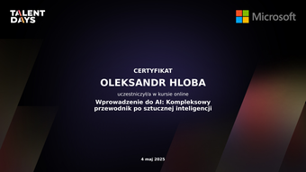

<!-- markdownlint-disable MD033 MD041 -->
<!-- /* cspell:locale en / -->
<!-- LTeX: language=en-US-->

## [You can support me](https://buy.stripe.com/dR6fYY6hC6ey76geXw)

by paying for my [ISPO](https://www.ispoint.org) membership, so I can try to join a 

---

## **Portfolio**

[link](https://o-leksandr.github.io) / [source](https://github.com/o-leksandr/o-leksandr.github.io)

---

## **Key Skills**

* ⚙️ Automation & Scripting
* 🧠 System Design for Automation
* 🐧 Linux System Administration
* 🪛 Debugging & Error Handling
* 🔄 CI/CD Pipeline Integration
* 📦 Workflow Bootstrapping
* 📝 Documentation & Code Quality
* 💻 Open Source Contributor
* 🧪 Version Control Best Practices
* 🤖 LLM-Powered Productivity

## **Tools & Technologies**

* Bash (advanced), Git, GitHub, Makefile
* FastAPI, Markdown, mkdocs
* VS Code, ShellCheck, markdownlint
* GitHub Actions (CI/CD), GitHub CLI (`gh`)
* GPT-based tooling & prompt engineering (LLMs for automation, DevOps, and documentation)

## **Platforms**

Linux, Windows

## **Soft Skills**

* ✅ Detail-oriented & self-directed
* 🗣 Strong communicator & knowledge sharer
* 📈 Growth-minded & reliable team player
* 🧩 Modular & scalable systems thinker
* ⏱️ Effective time manager — applies GTD principles and async workflows for focus and follow-through
* 📚 Language-learning awareness and cross-domain adaptation
* 🤝 Adaptive use of AI tools for productivity and continuous learning

## Certificates

  <!-- cspell:disable-next-line -->
  
  
  
  
  
  

---

## 💼 Available for freelance projects, consultations, or one-off automation tasks:

* [**Upwork**](https://www.upwork.com/freelancers/~015d8a2b4f2d082706)
* [**Fiverr**](https://www.fiverr.com/s/42djakR)
