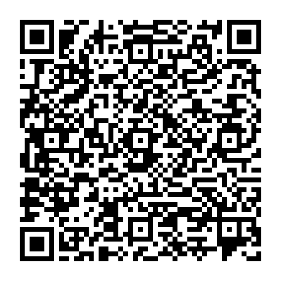

[portfolio](https://o-leksandr.github.io/)

---

[notebook](https://sourcecraft.dev/alexander-globa/notebook)

---

---

## 💼 Available for freelance projects:

* [**Upwork**](https://www.upwork.com/freelancers/~015d8a2b4f2d082706)
* [**Fiverr**](https://www.fiverr.com/s/42djakR)

---

## Following

* [bash](https://mywiki.wooledge.org/BashSheet)
